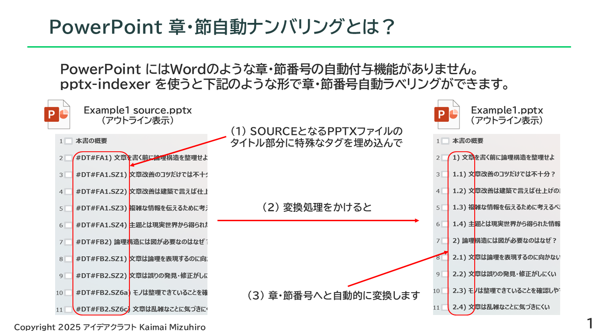
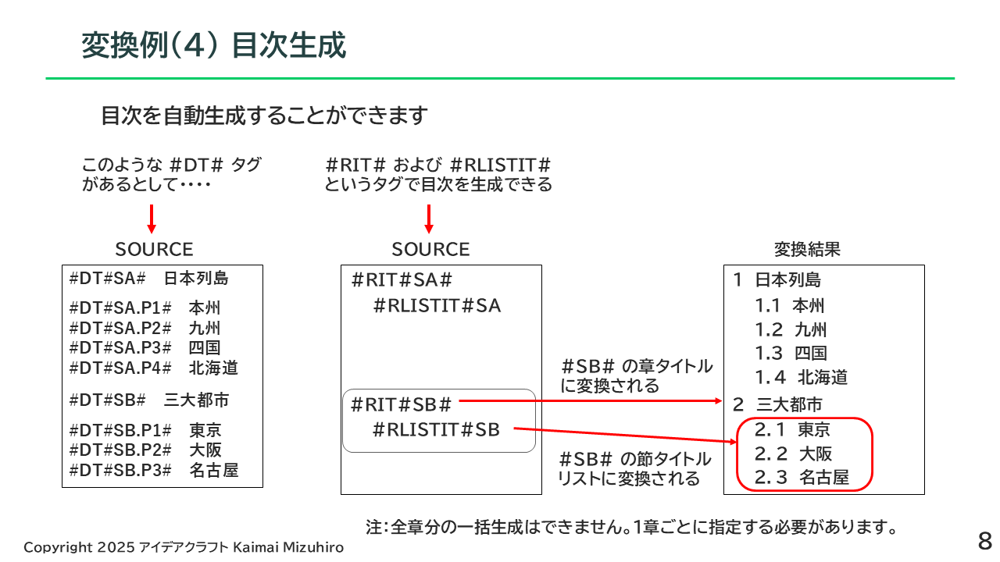
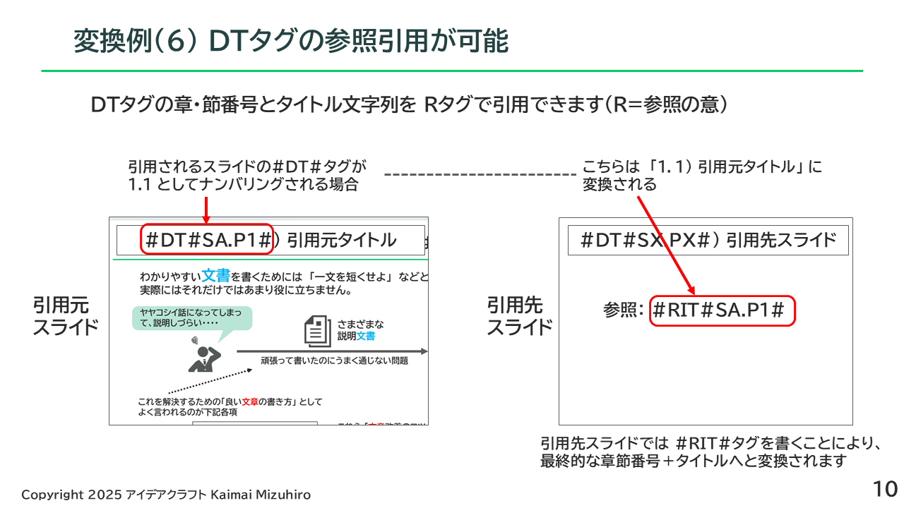
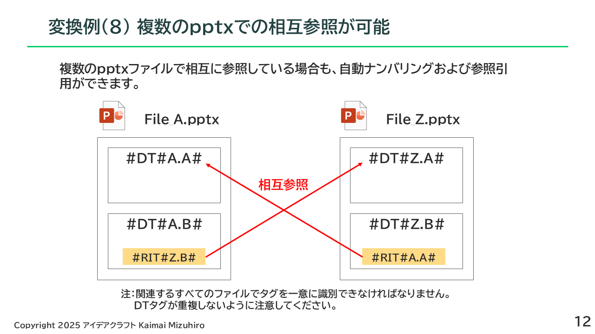

# Hierarchical Indexing and Labeling Tool for PowerPoint Files

This document and Introduction.pdf will be provided only in Japanese for the time being.

GitHubの使い方にも慣れていないので、改善提案いただけると助かります。
I'm not yet familiar with how to use GitHub, so I would appreciate any suggestions for improvement.

## 機能

PowerPointファイルへの階層的ナンバリングを行う python スクリプトです。
章・節番号を振りたい部分に特殊なコードを書いた pptx ファイルをソースとして、変換スクリプトをかけることによりその特殊コード部分を章・節番号に変換します。



機能紹介および詳しい使用法は [Introduction(PDF)](./docs/Introduction.pdf) をご覧ください。

目次生成、引用生成、複数のpptxでの相互参照も可能です。

### 目次生成



### 引用生成



### 複数のpptxでの相互参照



## 動作環境

開発は下記環境で行っています。

- Python 3.12.3
- python-pptx
- pywin32
- Windows11 Pro

## 使い方

コマンドラインでpythonスクリプトを起動して使います。
pythonの実行環境構築やコマンドライン操作等は自力でできることが前提です。
機能紹介および詳しい使用法は [Introduction(PDF)](./docs/Introduction.pdf) をご覧ください。

使用例を example/ex1 ディレクトリに入れてあります。

## 標準的な使用手順

### (1) ソースとなる pptx ファイルを用意する

 例： example/ex1/Example1_source.pptx

### (2) パラメータファイルを用意する

 例： example/ex1/SimpleParameterStandard.yaml

### (3) インデックスを生成する

 例：

 ```shell
 $ python3 PpIndexCollector.py example/ex1/SimpleParameterStandard.yaml
 finished collecting index information of example/ex1/SimpleParameterStandard.yaml
 ```

 生成物： example/ex1/Example1_index.json

### (4) コンバージョンを行う

 例：

 ```shell
 $ python3 PpIndexLabeller.py example/ex1/SimpleParameterStandard.yaml
 finished labeling of example/ex1/SimpleParameterStandard.yaml
 ```

 生成物： example/ex1/Example1.pptx
 （これが最終成果物）

## パラメータファイルの書き方

[Introduction(PDF)](./docs/Introduction.pdf) の最終ページをご覧ください。

## その他もろもろ

準備中です
