# Hierarchical Indexing and Labeling Tool for PowerPoint Files

This document and Introduction.pdf will be provided only in Japanese for the time being.

GitHubの使い方にも慣れていないので、改善提案いただけると助かります。
I'm not yet familiar with how to use GitHub, so I would appreciate any suggestions for improvement.

## 簡易用法でできること（相互参照が必要ない場合）

PowerPointファイルに自動で章・節番号を振るツールです。しかその他にも目次作成、相互参照、配布用資料に載せない情報の自動削除など、必要に迫られてさまざまな機能を実装しました。

### PowerPointに章節番号を振る手間を自動化したい

PowerPointにはMS-Wordのようなアウトライン機能が無いので、各スライドに下記のように章・節番号をつけようとすると手作業になり非常に手間がかかります。研修屋さんの仕事では巨大なpptxを使うことが多く、このようなナンバリングが必須なため悩みの種でした。特に、一度付番してからページの追加・削除・入れ替え等があると番号の振り直しが必要で、単純作業ですがミスも起こりやすく、やってられません。これを自動化したいわけです。

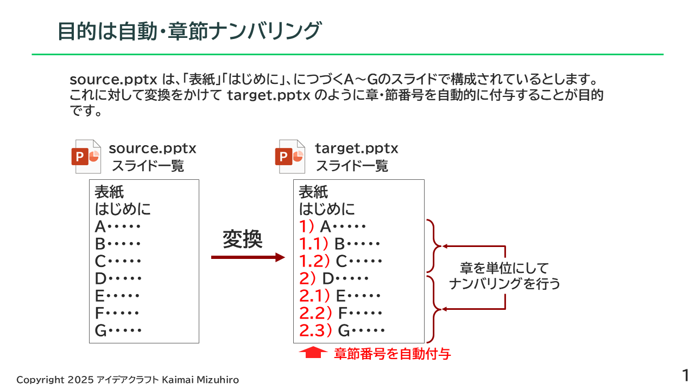

### 章の開始スライドが分かれば章節番号は自動計算できる

最も簡単に章節ナンバリングを行うには、各章の開始スライド（章とびら）を基準に節番号を自動計算するという方法があります。

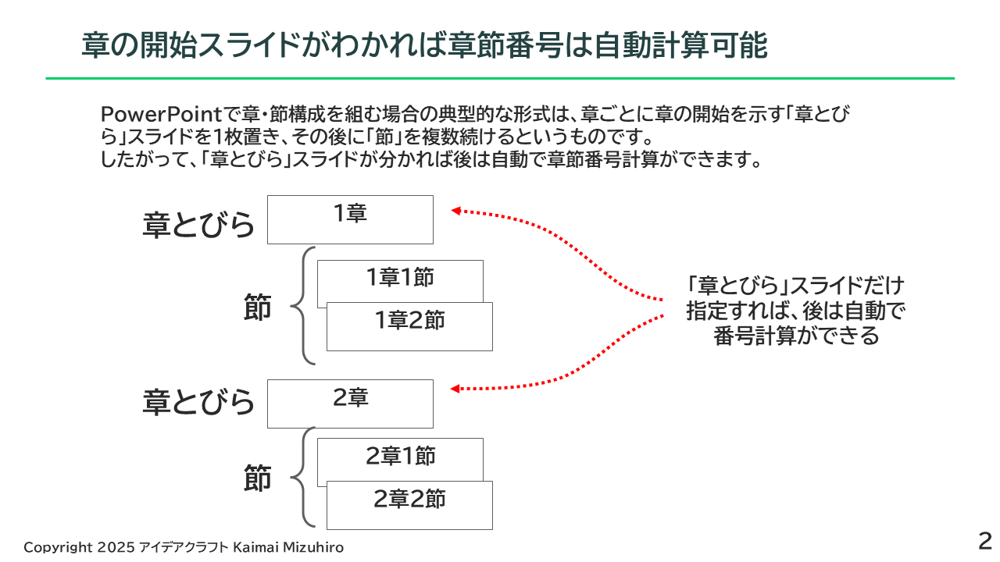

単に自動ナンバリングだけでよければこれが最も簡単な方法です。具体的には、章とびらスライドのどこかに CHAPT というタグを埋め込んで pptx-indexer にかけると自動ナンバリングを行います。

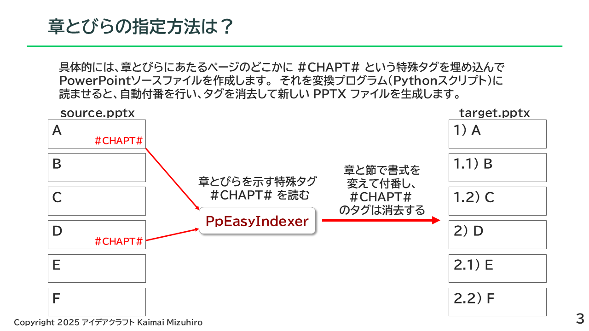

具体的な使用例、スクリプトの起動方法は下記リンクの pptx ファイルをご覧ください。

[01_EISample.pptx](./example/ex1/01_EISample.pptx)　CHAPT タグだけを使って章・節番号付与を行うサンプル

[01_EISample_generated.pptx](./example/ex1/01_EISample_generated.pptx)　01_EISample の変換結果

### 「章とびら」を使わないケース

章節構成でも「章とびら」を使わない場合もあります。その場合は CHAPT と同時に#SECTION# タグを使います。

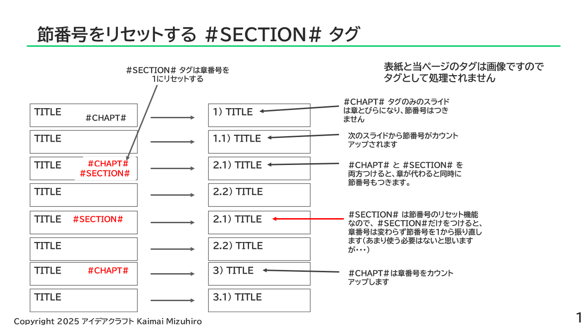

具体的な使用例、スクリプトの起動方法は下記リンクの pptx ファイルをご覧ください。

[02_EISample.pptx](./example/ex1/02_EISample.pptx)　CHAPT と #SECTION# を併用して章とびらなしの章節番号付与を行うサンプル

[02_EISample_generated.pptx](./example/ex1/02_EISample_generated.pptx)　02_EISample の変換結果

### 配付資料用に一部のスライドを自動削除したい

一部のスライドを配付資料から削除したいケースがあります。「このページまるごと、プレゼンター用原稿には載せるけど配付資料には載せたくないんだよね・・・・」という処理を簡単に行えます。配付資料から消したいスライドのどこかに #CSL# (cut slideの略) というタグを含めてください。--deletecsl というオプションをつけて変換するとそのスライドが削除されます。オプションをつけないと、#CSL# のタグのみ削除されます。このような方法で、プレゼンター/講師用のファイルと配付資料を1つのソースファイルから生成できます。

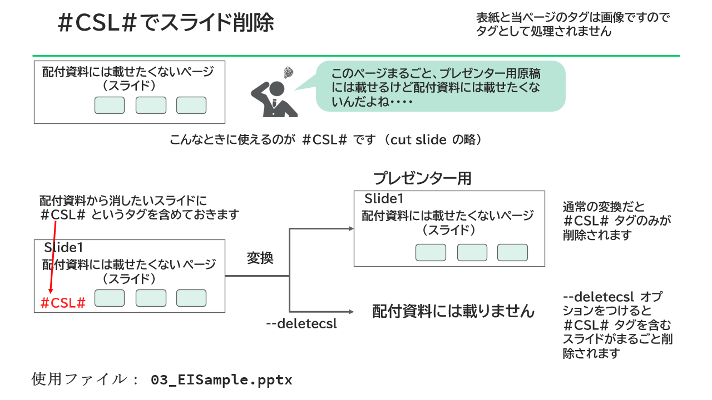

### 配付資料用に一部のシェイプ（図形）を自動削除したい

一部のシェイプ（図形）を配付資料から削除したいケースがあります。なお、PowerPoint では単純なテキストもシェイプの一種です。「このシェイプ（図形）、プレゼンター用原稿には載せるけど配付資料には載せたくないんだよね・・・・」という処理を簡単に行えます。配付資料から消したいシェイプのどこかに #CSP# (cut shapeの略) というタグを含めてください。--deletecsp というオプションをつけて変換するとそのシェイプが削除されます。オプションをつけないと、#CSL# のタグのみ削除されます。このような方法で、プレゼンター/講師用のファイルと配付資料を1つのソースファイルから生成できます。

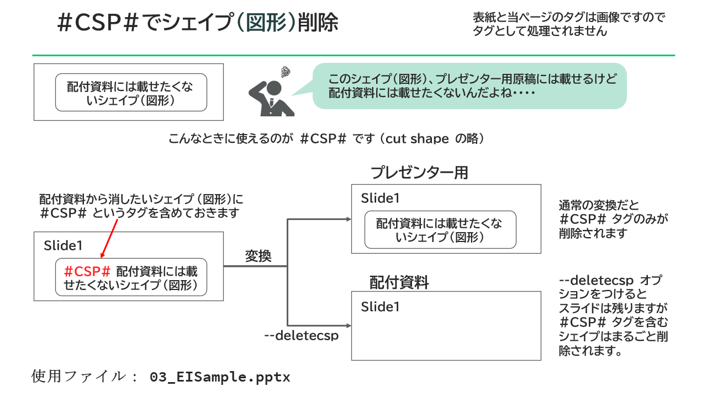

### 純粋なメモ用シェイプを無条件に削除したい

PowerPoint 原稿作成途中でメモ的な情報を一時的に書いておき、最終的には削除することがあります。「ここは後で書き足しておこう・・・」といった一時的メモを書くために使えるのが #MEMO#,#TEMP# タグです。これらのタグを含むシェイプは --deletecsp オプションとは無関係に常に削除されます。#MEMO# と #TEMP# の働きには差はありません。

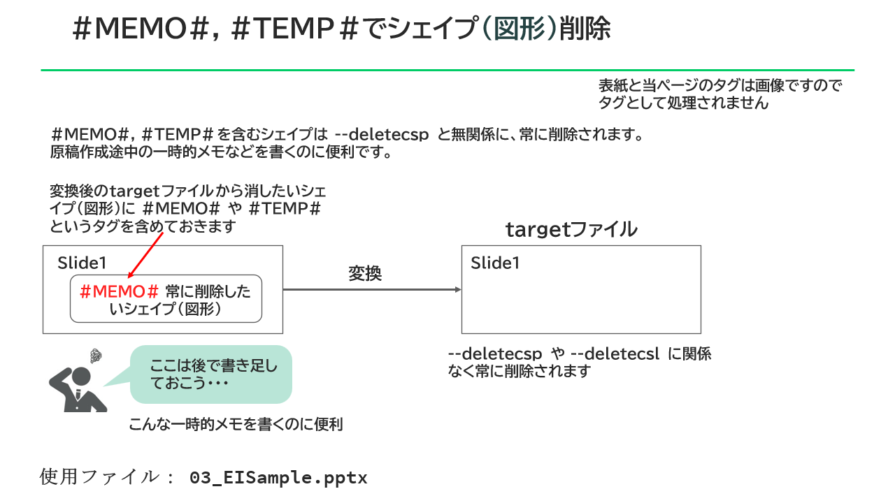

これら #CSP#, #CSL#, #TEMP#, #MEMO# の具体的な使用例、スクリプトの起動方法は下記リンクの pptx ファイルをご覧ください。

[03_EISample.pptx](./example/ex1/03_EISample.pptx)　CSL,CSP,MEMO,TEMP タグでコンテンツのコントロールを処理するサンプル

[03_EISample_generated.pptx](./example/ex1/03_EISample_generated.pptx)　03_EISample の変換結果（オプション指定なし）

[03_EISample_CSL.pptx](./example/ex1/03_EISample_CSL.pptx)　03_EISample の変換結果（--deletecsl オプションあり）

[03_EISample_CSP.pptx](./example/ex1/03_EISample_CSP.pptx)　03_EISample の変換結果（--deletecsp オプションあり）

### ソースファイル名と変換後ファイル名の指定

デフォルト動作では、生成される target ファイルには _generated が付加されます。

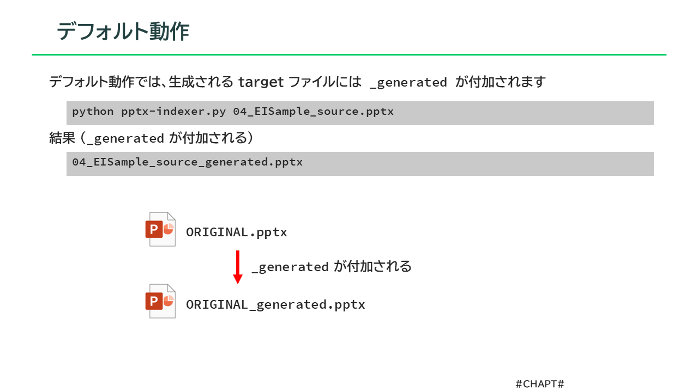

これを変更するには、--remove-source-trailer オプションと --target-trailer オプションを使用します。通常は変換後のファイルを後工程に渡すはずで、その場合 _source や _generated のような余計な文字列を含まないファイル名のほうが好ましいはずです。それにはこの機能を使用しましょう。

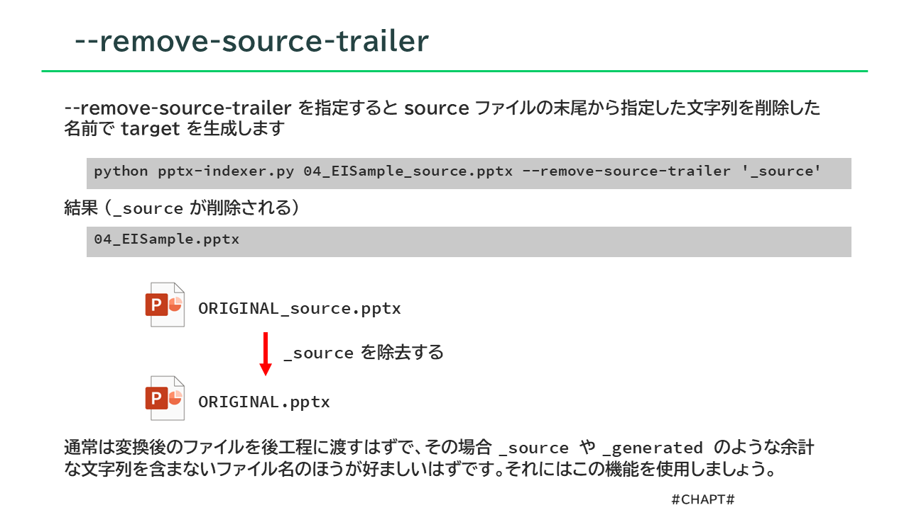

具体的な使用例、スクリプトの起動方法は下記リンクの pptx ファイルをご覧ください。

[04_EISample.pptx](./example/ex1/04_EISample.pptx)　source と target のファイル名を指定する方法のサンプル

04_EISample.pptx には変換後のファイルは添付しておりません。（

## 高機能用法でできること（目次作成、参照、複数ファイルの相互参照への対応）

簡易用法 (CHAPT タグ) でのナンバリングは簡単に使えますが、研修屋さんとして業務をしていると、目次作成、参照、複数ファイルの相互参照への対応など、より高度な機能が必要になりました。そこでそれに対応できるように開発したのが高機能用法です。

### 高機能用法ではDTタグを使用する

高機能用法では CHAPT タグではなく DT タグを使用します。

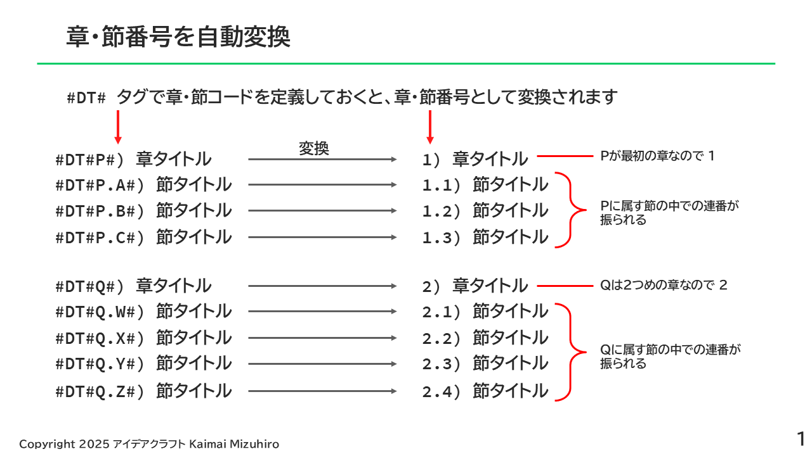

DTタグは通常、スライドのタイトル部分の先頭に埋め込みます（タイトル以外に使用することも可能です）。書式は次の通りです。

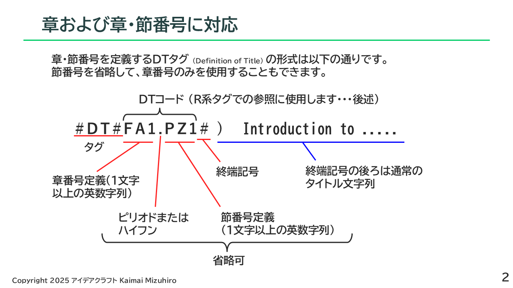

DTコードはスライドごとに固有のものを設定して、スライドの追加・削除・入れ替えをしても基本的に変えないようにします。（章をまたいで入れ替えたときは変えざるを得ませんが・・・）。これは「参照」を維持するために重要です。

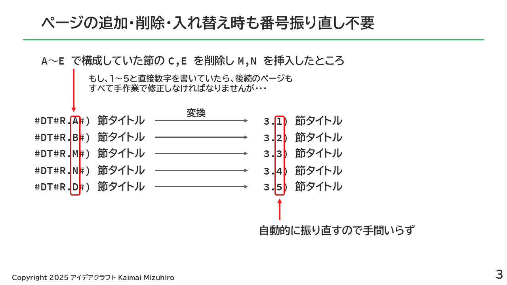

DTタグの簡単な使用例は下記リンクの pptx ファイルをご覧ください。

[01a_DTSample.pptx](./example/ex2/01a_DTSample.pptx) DTタグを使って章・節番号ナンバリングを処理するサンプル

[01a_DTSample_generated.pptx](./example/ex2/01a_DTSample_generated.pptx)　01a_DTSample の変換結果

### R系タグにDTコードを使って引用元を記載できる

RITタグに引用元のDTコードを記載すると、章・節番号＋タイトルに変換されます。スライド固有のDTコードで参照するので、章・節番号やタイトルに変更があっても自動的に修正されます。RITのようなタグには他にも種類があり、R系タグと総称します（後述）。

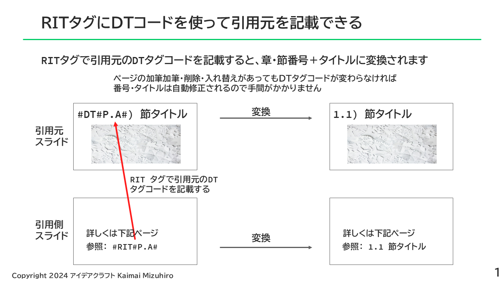

### 章単位でスライド一覧を作れる（目次作成に便利）

「章とびら」スライドに節の一覧を載せたい場合があります。このような場合、RLISTITタグによって章コードが一致する節のタイトル一覧を生成可能です。目次作成に応用することができます。

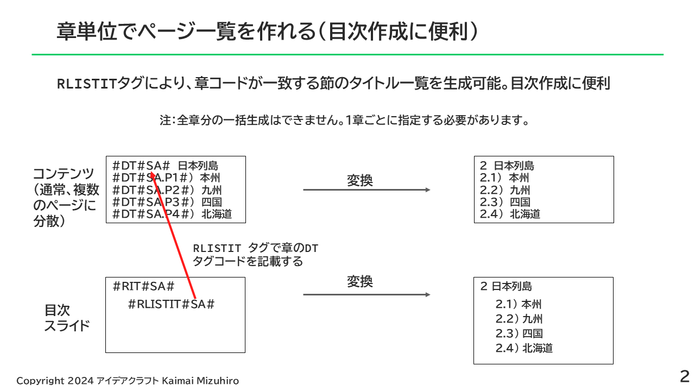

### スライド番号つき目次作成

少し手間がかかりますがスライド番号つきの目次生成も可能です。

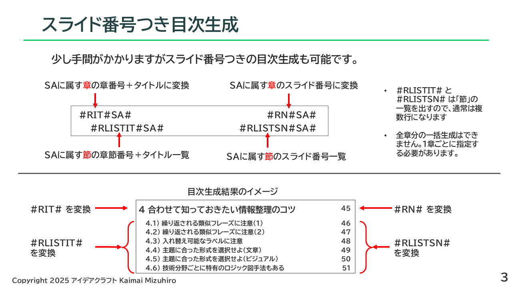

### 引用タグ(R系タグ)の使用例

R系タグにはいくつかのバリエーションがあります。

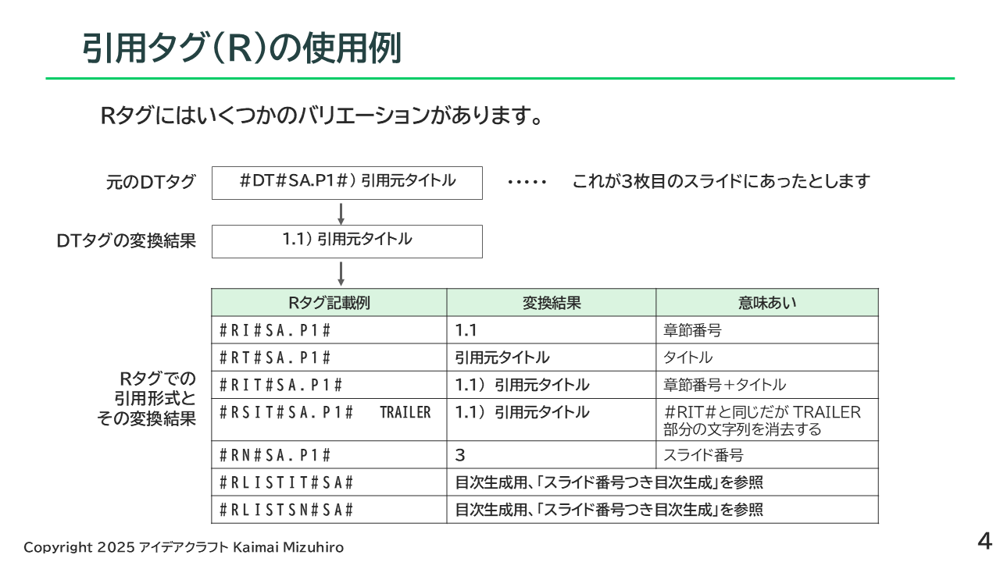

これらR系タグの具体的な使用例、スクリプトの起動方法は下記リンクの pptx ファイルをご覧ください。

[02_DTSample.pptx](./example/ex2/02_DTSample.pptx)　R系タグによるPowerPoint ファイルへの引用参照や目次作成機能のサンプル

[02_DTSample_generated.pptx](./example/ex2/02_DTSample_generated.pptx)　02_DTSample の変換結果

### 複数ファイルの相互参照

複数のpptxファイルで相互に参照している場合も、自動ナンバリングおよび参照引用ができます。

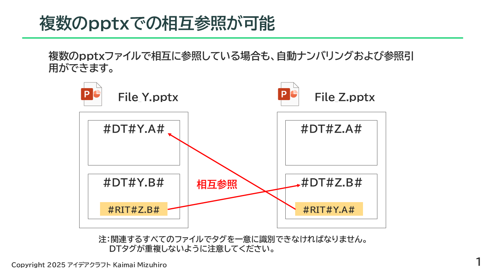

重要！ 相互参照を行うpptxの間でDTコードが重複しないようにご注意ください。

相互参照を行うためにはパラメータファイルを書く必要があり、そのためには基礎知識として pptx-indexer の処理モデルを知っておく必要があります。

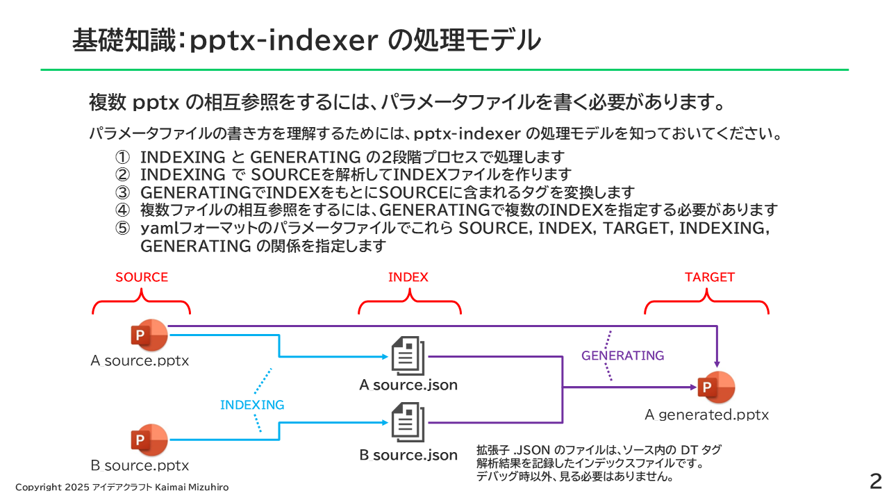

パラメータファイルの具体的な書式については下記リンクの pptx ファイルをご覧ください。

[03_DTSample.pptx](./example/ex2/03_DTSample.pptx) 複数の pptx ファイルで相互参照を行う用法のサンプル

## 開発環境

開発は下記環境で行っています。

- Python 3.12.3
- python-pptx
- pywin32
- Windows11 Pro

## 使い方

コマンドラインでpythonスクリプトを起動して使います。
pythonの実行環境構築やコマンドライン操作等は自力でできることが前提です。

コマンドの起動方法を含む使用例を記述した pptx ファイルを example/ex1 ディレクトリに入れてあるのでご利用ください。
